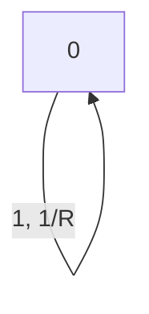
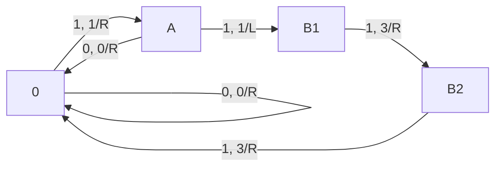

# `unituring` - A Python Universal Turing Machine (UTM) Emulator

This is a project in the course *Exotic Computing* at the University of Notre Dame.

- [`unituring` - A Python Universal Turing Machine (UTM) Emulator](#unituring---a-python-universal-turing-machine-utm-emulator)
  - [Usage](#usage)
  - [How It Works?](#how-it-works)
  - [Demos](#demos)
    - [Just Flip It](#just-flip-it)
    - [Two Ones Make Threes](#two-ones-make-threes)
  - [Todos](#todos)

## Usage

> For those who can't wait to get your hands on it, see [the demo section](#demos).

`unituring` is a Python script that implements a Universal Turing Machine (UTM), it takes the following command line arguments:

- `-a`  Toggle automatic running mode, default off.
- `-d`  Delimiter of the tape file, white spaces by default.
- `-s`  Specify the time of each iteration when auto mode toggled, 1 second by default.
- ~~`-v`  Toggle verbose mode, trace the step for checking transition rules.~~ (In development)
- `-t`  The path to the tape file.
- `-h`  Displays the usage.

On each step, the tape will be visualized in the terminal, with an arrow in the middle as the tape head pointing to the current cell.

The tape file is a plain text file composed in the following fashion. Differenr elements should be separated with a delimeter. Lines start with a pound sign `#` will be interpreted as comments and are ignored.


The initial state is `0` by default.

> Note that, the dollar sign `$` at the start of the tape are not included in the tape file, they are automatically inserted in loading the tape for machine.

## How It Works?

The following diagram briefly sketches how `unituring` works.


When a symbol is read, it's value is set to `int` type `-1` for future execution, and `unituring` will enter a new state represented by a tuple consisted of the current state and the current input symbol. They tape head will then go back to the start of the tape to match the transitions. Once a transition rule is matched, it's packed into the state of unituring as a tuple of the tape head movement, target symbol to write to the tape, and the target state.

## Demos

### Just Flip It

This is the most trivial example, the machine will simply flip 0 and 1 bits on the input tape. The state diagram is as follows.



Hence the transitions are as follows.

```
0 0 R 0 0
0 1 R 1 0
```

Run the following command to see this demo in action:

```bash
./unituring.py -a -t flip.txt
```

### Two Ones Make Threes

A slightly more elaborate demo. The machine will convert any two consective ones into two threes. The state transition diagram is shown below.



Hence the rules are specified as

```
0  1 R 1 A
A  1 L 1 B1
B1 1 R 3 B2
B2 1 R 3 0
0  0 R 0 0
A  0 R 0 0
```

Note that, if no delimeter or white space is specified as delimiter, `unituring` will consider multiple white spaces as a single delimiter.

Run the following command to see this demo in action:

```bash
./unituring.py -a -t 2123.txt
```

## To-dos

- [x] Load input tape, trace back the transition rules and do the executions.

- [x] Visualizing the machine in action.

- [x] Support `-s` option.

- [ ] Verbose mode
  Enable verbose mode with `-v` option, in which the steps for matching transition rules will be displayed as well.

- [ ] Manual mode
  Enable manual mode with `-a` option not specified, in which `unituring` will run for a single step whenever a keystroke is detected.

- [ ] Better visualization.

- [ ] Support tape with indefinite number of white spaces.

- [ ] A utility to parse a set of transitions in `json` file to input tape.

- [ ] Re-design the states interpretation of `unituring` instead of simply using tuples.

We could use a fixed-length binary number as state. With certain portion of the state representing different elements. For example, first 2 bits for internal state (i.e., initial, matching rules, going right to resume execution, etc.) and the following 4 bits for current state, 4 bits for current symbols, 1 bit for tape movement, and so on.

I could have write a 2-tape machine at the very start, this would make the project much easier.
